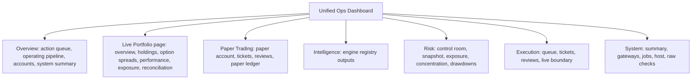
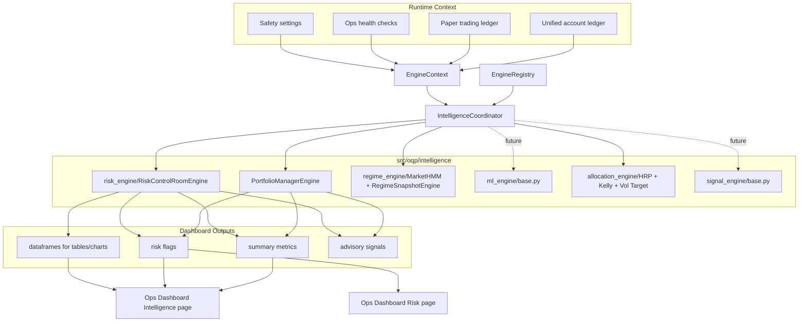

# Alpha Factory Architecture

Last reviewed: 2026-06-29

This document is the current restructuring checkpoint. The repo is converging
toward two dashboard surfaces backed by shared, testable modules under
`src/oqp`: a research lab and a unified operations cockpit.

## Current Shape

```mermaid
flowchart TD
    subgraph Dashboards["Dashboard Surfaces"]
        Research["Research Dashboard"]
        Ops["Unified Ops Dashboard"]
    end

    subgraph Core["src/oqp Shared Core"]
        Config["config and paths"]
        Brokers["broker adapters"]
        Accounts["account ledger and reporting"]
        PaperCore["paper trading ledger and safety"]
        Execution["proposal contracts and guardrails"]
        Risk["risk analytics"]
        Intelligence["intelligence engines"]
        Options["options analytics"]
        Investing["investing and valuation"]
        OpsCore["ops health probes"]
    end

    subgraph State["Runtime State"]
        Artifacts["runtime/artifacts"]
        AccountDB["runtime/db/accounts/account_ledger.db"]
        PaperDB["runtime/db/paper_trading/paper_trading.db"]
        Logs["logs"]
    end

    subgraph External["External Systems"]
        IBKRPaper["IBKR paper gateway"]
        IBKRLive["IBKR live gateway, read-only"]
        Vendors["FMP / Massive / market data"]
        Discord["Discord webhooks"]
    end

    Research --> Artifacts
    Research --> Execution
    Ops --> Accounts
    Ops --> PaperCore
    Ops --> Execution
    Ops --> Risk
    Ops --> Intelligence
    Ops --> Options
    Ops --> Investing
    Ops --> OpsCore
    Brokers --> IBKRPaper
    Brokers --> IBKRLive
    Accounts --> AccountDB
    PaperCore --> PaperDB
    Execution --> Artifacts
    Investing --> Vendors
    Options --> Vendors
    OpsCore --> Logs
    PaperCore --> Discord
```



## Department Map

```text
apps/
  research_dashboard/          research and factor-promotion surface
  ops_dashboard/               unified live, paper, risk, execution, server cockpit

src/oqp/
  accounts/                    account snapshots, NAV history, reporting
  brokers/                     broker contracts and IBKR read-only adapters
  config/                      settings, paths, environment loading
  contracts/                   strategy candidate artifacts
  execution/                   proposal contracts and guardrails
  investing/                   valuation and portfolio utilities
  intelligence/                modular advisory engines and coordinator
  market/                      price-history and volatility helpers
  ops/                         operational health models
  options/                     options analytics
  paper_trading/               paper ledgers, reviews, tickets, runner, submitter gates
  portfolio/                   legacy/live portfolio ingestion and NAV helpers
  risk/                        risk analytics

departments/
  research/                    alpha-lab policy and public/private boundary
  trading/                     paper trading process docs and order examples
  risk/                        options risk policy and promotion notes
  data_platform/               storage map and data process notes
  middle_office/               account contracts, controls, reconciliation
  platform/                    deployment and scheduler runbooks
  archive/                     retired legacy source references
```

## Paper Trading Pipeline

```mermaid
flowchart LR
    Candidate["research candidate artifact"] --> Approval["strategy approval / promotion"]
    Approval --> Registry["approved paper strategy registry"]
    Registry --> Intelligence["portfolio manager intelligence layer"]
    Intelligence --> Trigger["runtime trigger decision"]
    Trigger --> Proposal["trade proposal artifact"]
    Proposal --> Review["safety review"]
    Review --> Ticket["order ticket"]
    Ticket --> Decision["human or configured approval"]
    Decision --> Preflight["submission preflight"]
    Preflight --> Submitter["guarded broker submitter"]
    Submitter -. default locked .-> IBKR["IBKR paper account"]

    IBKR --> Snapshot["paper snapshot job"]
    Snapshot --> AccountLedger["unified account ledger"]
    AccountLedger --> Dashboard["unified ops dashboard"]
    AccountLedger -. fallback .-> PaperDashboard["paper dashboard"]
    AccountLedger --> Discord["daily Discord report"]
```



Current paper status:

- IBKR paper monitoring is wired.
- Daily paper snapshots write the unified account ledger.
- The unified ops dashboard reads account NAV, holdings, P&L, returns, events,
  paper reviews, paper tickets, gateway health, jobs, and alerts.
- Discord daily paper reports read the same account ledger.
- Strategy approval, proposal scanning, safety review, and dry-run ticket
  creation exist.
- Broker order submission exists for approved paper tickets, but remains locked
  by default through `ALLOW_PAPER_ORDER_SUBMIT=false` and the read-only paper
  profile.

## Unified Ops Dashboard Pages

The Ops Dashboard is the daily operating cockpit:



The rule is UI consolidation without storage or execution consolidation: live,
paper, account, portfolio, and system data keep separate ledgers and gates even
though they are visible in one cockpit.

Live Portfolio has now been split into a first-class Streamlit sidebar page:

```text
apps/ops_dashboard/pages/01_Live_Portfolio.py
```

It reads the unified account ledger and renders:

- Overview: NAV curve, daily P&L, cash vs invested, system reads
- Holdings: current holdings enriched with `HV 5D`, `HV 20D`, option metadata,
  Greeks when available, and spread group
- Option Spreads: recognized option packages, leg audit, underlying exposure
- Performance: drawdown, cumulative return, monthly returns
- Exposure: asset mix, gross exposure vs NAV, historical symbol/asset exposure
- Reconciliation: account ledger freshness, price-history cache status, Ops
  checks, latest live events

Shared helpers:

- `src/oqp/market/volatility.py`: price-history normalization and HV helpers
- `src/oqp/options/spread_recognition.py`: option leg parsing, spread grouping,
  and underlying exposure
- `src/oqp/portfolio/live_reporting.py`: enriched live holdings table

## Intelligence Engine Layer

The intelligence layer follows the same modular ideology as
`alpha_research_lab`: each category owns its own folder, base contracts, and
future model implementations, while one coordinator runs the selected engines.
This keeps model logic out of Streamlit pages and makes dashboard decisions
testable.



Current implementation:

- `EngineContext` carries live/paper summaries, NAV history, positions, events,
  approved strategy rosters, strategy signals, and safety settings.
- `BaseEngine` and `EngineResult` define the common interface.
- `EngineRegistry` and `IntelligenceCoordinator` run engines by id and capture
  failures into structured results.
- `PortfolioManagerEngine` is the post-approval command layer. Once a strategy
  is approved, this engine decides runtime posture: triggerable, waiting for
  signal, paper paused, or live locked.
- `risk_engine/RiskControlRoomEngine` produces account risk summaries,
  concentration reads, and warning flags for the Ops Risk page.
- `regime_engine/MarketHMM` and `MarketGMMHMM` mirror the alpha-lab HMM class
  layout: emissions, `fit`, `_align_states`, `predict`, `predict_proba`,
  `save`, and `load`, with state alignment by volatility.
- `regime_engine/RegimeSnapshotEngine` gives the Ops Dashboard a lightweight
  return/volatility regime read before a trained HMM artifact is promoted.
- `allocation_engine` now has HRP, fractional Kelly, volatility targeting, and
  weight constraint helpers. The registered allocation advisory engine stays
  skipped until research returns/signals are passed into `EngineContext`.

Intelligence is not the research approval gate. Research approval says a
strategy is allowed to run in a given market/account lane. The intelligence
layer is the portfolio-manager command center that decides whether approved
strategies should trigger now, what sizing posture is sensible, or whether the
strategy should pause because of regime, cash, drawdown, risk, or account
constraints. Execution still remains behind the existing proposal, review,
ticket, and submitter gates.

## Live Trading Boundary

Live trading is future-gated. The current live IBKR lane is account monitoring
only.

Rules:

- `ALLOW_LIVE_TRADING=false` stays the default.
- live IBKR profiles are read-only.
- live order submission code should not be added until paper trials have
  durable performance evidence, kill-switch behavior, reconciliation, and a
  dedicated approval workflow.
- a dedicated IBKR API username should be used for server-side live monitoring
  so normal Client Portal or phone usage does not interrupt Gateway sessions.

## Public / Private Boundary

The public-safe platform is the architecture, contracts, dashboards, test
fixtures, deployment templates, and sanitized examples.

Private by default:

- live alpha factor implementations
- candidate, trial, promotion, sweep, and backtest artifacts
- execution logs, return series, cached research data, and vendor exports
- broker account state, ledgers, env files, and local Streamlit secrets
- local model checkpoints and diagnostic research images

Before staging a public commit:

```bash
python scripts/check_public_commit_hygiene.py
git diff --cached --stat
git diff --cached --name-only
```

To audit the current dirty worktree:

```bash
python scripts/check_public_commit_hygiene.py --all
```

The dirty-worktree audit is expected to fail while private alpha-lab work is in
progress. Public commits should use explicit path staging rather than
`git add -A`.

## Restructuring Status

Done:

- dashboard surfaces have been consolidated toward Research + Unified Ops
- shared contracts and ledgers live under `src/oqp`
- Middle Office is no longer the active root app
- server deployment has reproducible runbooks, env templates, and systemd units
- live and paper IBKR gateways are separated
- paper account storage, dashboard reporting, and Discord reporting are wired
- modular intelligence engine layer is wired into Ops Intelligence and Risk pages
- guarded paper order submission path exists but is not enabled by default
- public/private alpha research policy exists

Still gated:

- routine paper broker order submission and fill reconciliation
- live trading execution architecture
- final public-release scrub of alpha research work
- long-form README polish and notebook curation
