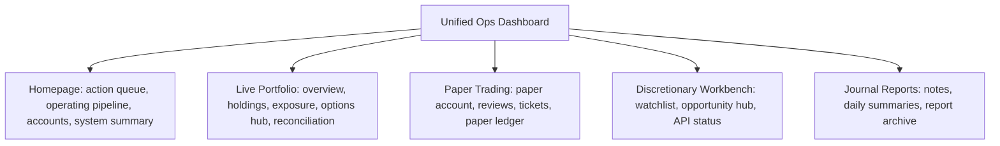

# Alpha Factory Architecture

Last reviewed: 2026-07-17

Alpha Factory is a modular quantitative research and trading-operations system.
It is designed both as a working research platform and as reproducible evidence
of quantitative engineering practice. The public identity is institution-neutral;
`oqp` remains only the stable Python package and command namespace.

This document is the complete current architecture checkpoint. The repository
is organized around two dashboard surfaces backed by shared, testable modules
under `src/oqp`: a research lab and a unified operations cockpit. It describes
the intended ownership boundaries as well as the parts that are already wired,
still guarded, or deliberately kept private.

## Architecture Principles

1. **Reproducible research**: data lineage, assumptions, configurations, seeds,
   artifacts, and tests must make a result explainable and repeatable.
2. **Domain ownership**: calculations and rules live in the owning `src/oqp/`
   domain; dashboards display them and scripts orchestrate them.
3. **Broker and vendor neutrality**: canonical contracts separate the platform
   from IBKR, QMT, Massive, FMP, and other optional integrations.
4. **Taxonomy awareness**: data, factors, backtests, risk models, and options
   workflows declare the asset classes and market lanes they support.
5. **Truthful data handling**: accounting views may value from forward-filled
   observations, while alpha and execution paths honor freshness and missingness
   flags rather than treating synthetic prices as new information.
6. **Guarded execution**: research promotion, proposals, review, tickets,
   submission, and reconciliation remain separate stages. Live execution is
   disabled by default.
7. **Public/private separation**: framework code and sanitized examples can be
   published without exposing live alpha, broker state, credentials, or vendor
   data.

## End-To-End Lifecycle

```mermaid
flowchart LR
    Sources["Exchange, vendor, broker, or demo sources"] --> Normalize["Canonical data and instrument taxonomy"]
    Normalize --> Quality["Quality, missingness, freshness, and lineage checks"]
    Quality --> Research["Factors, patterns, regimes, and backtests"]
    Research --> Evidence["Diagnostics, robustness, assumptions, and artifacts"]
    Evidence --> Promotion["Research promotion decision"]
    Promotion --> Paper["Paper proposal, review, ticket, and guarded submission"]
    Paper --> Reconcile["Account snapshots, fills, valuation, and reconciliation"]
    Reconcile --> Ops["Ops Dashboard, risk, options, and health monitoring"]
    Ops --> Feedback["Observed performance and operational evidence"]
    Feedback --> Research
```



The lifecycle is intentionally not one monolithic engine. Research can run
without a broker, the dashboards can run from deterministic demo state, and a
broker adapter can be replaced without rewriting factor, portfolio, or risk
logic.

## Current Shape

```mermaid
flowchart TD
    subgraph Dashboards["Dashboard Surfaces"]
        Research["Research Dashboard"]
        Ops["Unified Ops Dashboard"]
    end

    subgraph Core["src/oqp Shared Core"]
        Config["config and paths"]
        Data["data contracts and adapters"]
        Brokers["broker adapters"]
        Accounts["account ledger and reporting"]
        PaperCore["paper trading ledger and safety"]
        Execution["proposal contracts and guardrails"]
        Risk["risk analytics"]
        ResearchCore["research models and backtesting"]
        Options["options analytics"]
        Investing["investing and valuation"]
        OpsCore["ops health probes"]
    end

    subgraph State["Runtime State"]
        RuntimeData["runtime/data"]
        Artifacts["runtime/artifacts"]
        AccountDB["runtime/db/accounts/account_ledger.db"]
        PaperDB["runtime/db/paper_trading/paper_trading.db"]
        Logs["runtime/logs"]
    end

    subgraph External["External Systems"]
        IBKRPaper["IBKR paper gateway"]
        IBKRLive["IBKR live gateway, read-only"]
        Vendors["FMP / Massive / market data"]
        Discord["Discord webhooks"]
    end

    Research --> Artifacts
    Research --> Data
    Data --> RuntimeData
    Data --> Vendors
    Research --> Execution
    Ops --> Accounts
    Ops --> PaperCore
    Ops --> Execution
    Ops --> Risk
    Research --> ResearchCore
    Ops --> Options
    Ops --> Investing
    Ops --> OpsCore
    Brokers --> IBKRPaper
    Brokers --> IBKRLive
    Accounts --> AccountDB
    PaperCore --> PaperDB
    Execution --> Artifacts
    Investing --> Vendors
    Options --> Vendors
    OpsCore --> Logs
    PaperCore --> Discord
```



## Department Map

```text
apps/
  research_dashboard/          research and factor-promotion surface
  ops_dashboard/               unified live, paper, risk, execution, server cockpit

src/oqp/
  accounts/                    account snapshots, NAV history, reporting
  brokers/                     broker contracts and IBKR read-only adapters
  config/                      settings, paths, environment loading
  contracts/                   strategy candidate artifacts
  data/                        data contracts, taxonomy, adapters, and quality views
  execution/                   proposal contracts and guardrails
  investing/                   valuation and portfolio utilities
  market/                      price-history and volatility helpers
  ops/                         operational health models
  options/                     options analytics
  paper_trading/               paper ledgers, reviews, tickets, runner, submitter gates
  portfolio/                   legacy/live portfolio ingestion and NAV helpers
  research/                    factors, backtesting, ML, regimes, and diagnostics
  risk/                        risk analytics

departments/
  research/                    alpha-lab policy and public/private boundary
  trading/                     paper trading process docs and order examples
  risk/                        risk appetite, limits, scenarios, and model policy
  data_platform/               data catalog, governance contracts, and runbooks
  middle_office/               account contracts, controls, reconciliation
  platform/                    deployment and scheduler runbooks
```

## Paper Trading Pipeline

```mermaid
flowchart LR
    Candidate["research candidate artifact"] --> Approval["strategy approval / promotion"]
    Approval --> Registry["approved paper strategy registry"]
    Registry --> Trigger["runtime trigger decision"]
    Trigger --> Proposal["trade proposal artifact"]
    Proposal --> Review["safety review"]
    Review --> Ticket["order ticket"]
    Ticket --> Decision["human or configured approval"]
    Decision --> Preflight["submission preflight"]
    Preflight --> Submitter["guarded broker submitter"]
    Submitter -. default locked .-> IBKR["IBKR paper account"]

    IBKR --> Snapshot["paper snapshot job"]
    Snapshot --> AccountLedger["unified account ledger"]
    AccountLedger --> Dashboard["unified ops dashboard"]
    AccountLedger -. fallback .-> PaperDashboard["paper dashboard"]
    AccountLedger --> Discord["daily Discord report"]
```



Current paper status:

- IBKR paper monitoring is wired.
- Daily paper snapshots write the unified account ledger.
- The unified ops dashboard reads account NAV, holdings, P&L, returns, events,
  paper reviews, paper tickets, gateway health, jobs, and alerts.
- Discord daily paper reports read the same account ledger.
- Strategy approval, proposal scanning, safety review, and dry-run ticket
  creation exist.
- Broker order submission exists for approved paper tickets, but remains locked
  by default through `ALLOW_PAPER_ORDER_SUBMIT=false` and the read-only paper
  profile.

## Unified Ops Dashboard Pages

The Ops Dashboard is the daily operating cockpit:



The rule is UI consolidation without storage or execution consolidation: live,
paper, account, portfolio, and system data keep separate ledgers and gates even
though they are visible in one cockpit.

Live Portfolio has now been split into a first-class Streamlit sidebar page:

```text
apps/ops_dashboard/pages/01_Live_Portfolio.py
```

It reads the unified account ledger and renders:

- Overview: NAV curve, drawdown/benchmark/leverage-style performance view,
  weekly performance, asset sleeve mix, daily P&L, and system reads.
- Holdings: IBKR plus manual external holdings, native/reporting currency,
  market value, cost basis, unrealized P&L, and available `HV 5D` / `HV 20D`.
- Exposure: sector, sleeve, currency, concentration, option-adjusted
  underlying exposure, factor-proxy diagnostics, and PCA crowding.
- Options Hub: option book audit, recognized packages, merged payoff and Greeks
  lab, and volatility/model quality checks.
- Reconciliation: account ledger freshness, risk lab structure, risk-history
  cache status, Ops checks, and latest live events.

Shared helpers:

- `src/oqp/market/volatility.py`: price-history normalization and HV helpers
- `src/oqp/options/spread_recognition.py`: option leg parsing, spread grouping,
  and underlying exposure
- `src/oqp/portfolio/live_reporting.py`: enriched live holdings table

## Domain Ownership

Model code is grouped by accountable domain rather than by a generic engine
type. `research` owns backtests, factor contracts, ML, regime estimation, and
optional allocators; `risk` owns independent measurements, limits, and
scenarios; `options` owns contract lifecycle and derivatives analytics;
`investing` owns discretionary research evidence. Dashboard pages consume
these APIs but do not define model rules or thresholds.

The former generic intelligence coordinator had no active runtime caller and
duplicated research allocation and Risk policy. It was removed after its useful
HMM and directional lens moved to `research.ml.regimes` and
`investing.directional_lens`.

## Live Trading Boundary

Live trading is future-gated. The current live IBKR lane is account monitoring
only.

Rules:

- `ALLOW_LIVE_TRADING=false` stays the default.
- live IBKR profiles are read-only.
- live order submission code should not be added until paper trials have
  durable performance evidence, kill-switch behavior, reconciliation, and a
  dedicated approval workflow.
- a dedicated IBKR API username should be used for server-side live monitoring
  so normal Client Portal or phone usage does not interrupt Gateway sessions.

## Public / Private Boundary

The public-safe platform is the architecture, contracts, dashboards, test
fixtures, deployment templates, and sanitized examples.

Private by default:

- live alpha factor implementations
- candidate, trial, promotion, sweep, and backtest artifacts
- execution logs, return series, cached research data, and vendor exports
- broker account state, ledgers, env files, and local Streamlit secrets
- local model checkpoints and diagnostic research images

Before staging a public commit:

```bash
python scripts/platform/check_public_commit_hygiene.py
git diff --cached --stat
git diff --cached --name-only
```

To audit the current dirty worktree:

```bash
python scripts/platform/check_public_commit_hygiene.py --all
```

The dirty-worktree audit is expected to fail while private alpha-lab work is in
progress. Public commits should use explicit path staging rather than
`git add -A`.

## Restructuring Status

Done:

- dashboard surfaces have been consolidated toward Research + Unified Ops
- shared contracts and ledgers live under `src/oqp`
- Middle Office is no longer the active root app
- server deployment has reproducible runbooks, env templates, and systemd units
- live and paper IBKR gateways are separated
- paper account storage, dashboard reporting, and Discord reporting are wired
- domain-owned research, investing, and risk services are wired into Ops and Research pages
- guarded paper order submission path exists but is not enabled by default
- public/private alpha research policy exists

Still gated:

- routine paper broker order submission and fill reconciliation
- live trading execution architecture
- final public-release scrub of alpha research work
- long-form README polish and notebook curation
