# Alpha Factory Architecture

Last reviewed: 2026-06-26

This document is the current restructuring checkpoint. The repo is organized as
four dashboard surfaces backed by shared, testable modules under `src/oqp`.

## Current Shape

```mermaid
flowchart TD
    subgraph Dashboards["Dashboard Surfaces"]
        Research["Research Dashboard"]
        Paper["Paper Trading Dashboard"]
        Money["Money Dashboard"]
        Ops["Ops Dashboard"]
    end

    subgraph Core["src/oqp Shared Core"]
        Config["config and paths"]
        Brokers["broker adapters"]
        Accounts["account ledger and reporting"]
        PaperCore["paper trading ledger and safety"]
        Execution["proposal contracts and guardrails"]
        Risk["risk analytics"]
        Options["options analytics"]
        Investing["investing and valuation"]
        OpsCore["ops health probes"]
    end

    subgraph State["Runtime State"]
        Artifacts["runtime/artifacts"]
        AccountDB["runtime/db/accounts/account_ledger.db"]
        PaperDB["data/paper_trading/paper_trading.db"]
        Logs["logs"]
    end

    subgraph External["External Systems"]
        IBKRPaper["IBKR paper gateway"]
        IBKRLive["IBKR live gateway, read-only"]
        Vendors["FMP / Massive / market data"]
        Discord["Discord webhooks"]
    end

    Research --> Artifacts
    Research --> Execution
    Paper --> Accounts
    Paper --> PaperCore
    Paper --> Execution
    Money --> Accounts
    Money --> Risk
    Money --> Options
    Money --> Investing
    Ops --> OpsCore

    Brokers --> IBKRPaper
    Brokers --> IBKRLive
    Accounts --> AccountDB
    PaperCore --> PaperDB
    Execution --> Artifacts
    Investing --> Vendors
    Options --> Vendors
    OpsCore --> Logs
    PaperCore --> Discord
```



## Department Map

```text
apps/
  research_dashboard/          research and factor-promotion surface
  paper_trading_dashboard/     paper account, proposals, tickets, performance
  money_dashboard/             real portfolio, options, investing, risk
  ops_dashboard/               server and job health

src/oqp/
  accounts/                    account snapshots, NAV history, reporting
  brokers/                     broker contracts and IBKR read-only adapters
  config/                      settings, paths, environment loading
  contracts/                   strategy candidate artifacts
  execution/                   proposal contracts and guardrails
  investing/                   valuation and portfolio utilities
  ops/                         operational health models
  options/                     options analytics
  paper_trading/               paper ledgers, reviews, tickets, runner, submitter gates
  portfolio/                   legacy/live portfolio ingestion and NAV helpers
  risk/                        risk analytics

departments/
  research/                    alpha-lab policy and public/private boundary
  trading/                     paper/live trading process docs
  investing/                   portfolio book and performance plans
  risk/                        portfolio, factor, limits, and options risk plans
  data_platform/               vendors, market data, instrument master, feature store
  middle_office/               controls, reporting, reconciliation
  platform/                    deployment, observability, schedulers
  archive/                     retired legacy source references
```

## Paper Trading Pipeline

```mermaid
flowchart LR
    Candidate["research candidate artifact"] --> Registry["paper strategy registry"]
    Registry --> Proposal["trade proposal artifact"]
    Proposal --> Review["safety review"]
    Review --> Ticket["dry-run order ticket"]
    Ticket --> Decision["human approve/reject"]
    Decision --> Preflight["submission preflight"]
    Preflight --> Submitter["guarded broker submitter"]
    Submitter -. default locked .-> IBKR["IBKR paper account"]

    IBKR --> Snapshot["paper snapshot job"]
    Snapshot --> AccountLedger["unified account ledger"]
    AccountLedger --> Dashboard["paper dashboard"]
    AccountLedger --> Discord["daily Discord report"]
```



Current paper status:

- IBKR paper monitoring is wired.
- Daily paper snapshots write the unified account ledger.
- The paper dashboard reads account NAV, holdings, P&L, returns, and events.
- Discord daily paper reports read the same account ledger.
- Strategy proposal scanning and dry-run ticket creation exist.
- Broker order submission exists for approved paper tickets, but remains locked
  by default through `ALLOW_PAPER_ORDER_SUBMIT=false` and the read-only paper
  profile.

## Live Trading Boundary

Live trading is future-gated. The current live IBKR lane is account monitoring
only.

Rules:

- `ALLOW_LIVE_TRADING=false` stays the default.
- live IBKR profiles are read-only.
- live order submission code should not be added until paper trials have
  durable performance evidence, kill-switch behavior, reconciliation, and a
  dedicated approval workflow.
- a dedicated IBKR API username should be used for server-side live monitoring
  so normal Client Portal or phone usage does not interrupt Gateway sessions.

## Public / Private Boundary

The public-safe platform is the architecture, contracts, dashboards, test
fixtures, deployment templates, and sanitized examples.

Private by default:

- live alpha factor implementations
- candidate, trial, promotion, sweep, and backtest artifacts
- execution logs, return series, cached research data, and vendor exports
- broker account state, ledgers, env files, and local Streamlit secrets
- local model checkpoints and diagnostic research images

Before staging a public commit:

```bash
python scripts/check_public_commit_hygiene.py
git diff --cached --stat
git diff --cached --name-only
```

To audit the current dirty worktree:

```bash
python scripts/check_public_commit_hygiene.py --all
```

The dirty-worktree audit is expected to fail while private alpha-lab work is in
progress. Public commits should use explicit path staging rather than
`git add -A`.

## Restructuring Status

Done:

- dashboard surfaces are separated
- shared contracts and ledgers live under `src/oqp`
- Middle Office is no longer the active root app
- server deployment has reproducible runbooks, env templates, and systemd units
- live and paper IBKR gateways are separated
- paper account storage, dashboard reporting, and Discord reporting are wired
- guarded paper order submission path exists but is not enabled by default
- public/private alpha research policy exists

Still gated:

- routine paper broker order submission and fill reconciliation
- live trading execution architecture
- final public-release scrub of alpha research work
- long-form README polish and notebook curation
