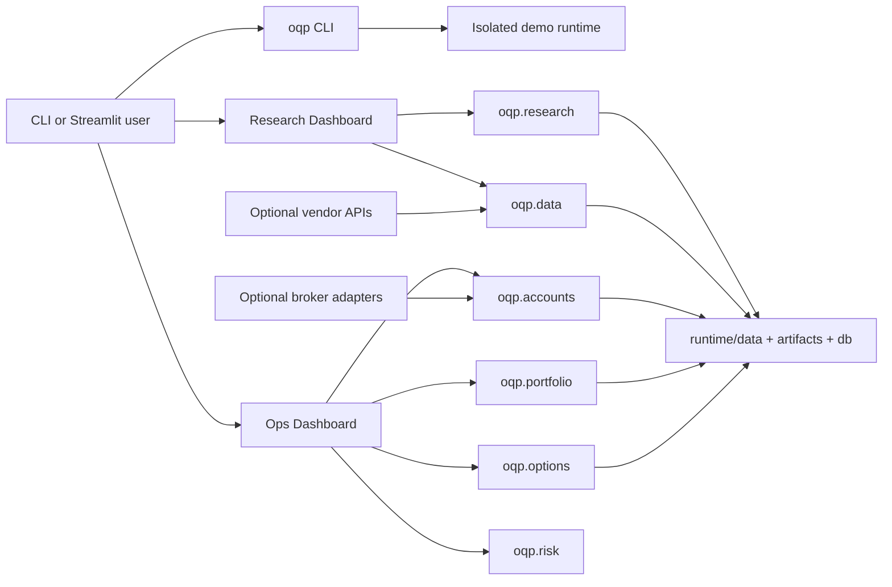

# Alpha Factory

Alpha Factory is a modular quantitative research and trading
operations platform. It combines reproducible factor research, taxonomy-aware
backtesting, portfolio and options analytics, paper-trading controls, account
ledgers, and two Streamlit dashboards.

The installed command and Python namespace remain `oqp` for compatibility.
They are technical identifiers, not the public project name.

## Platform At A Glance

Alpha Factory has two primary user surfaces:

- **Research Dashboard**: data diagnostics, pattern and market-breadth labs,
  factor backtesting, strategy comparison, robustness analysis, and promotion
  evidence.
- **Ops Dashboard**: read-only portfolio monitoring, paper-trading review,
  options analytics, reconciliation, health checks, and guarded operational
  workflows.

Reusable logic lives in `src/oqp/`. The `apps/` layer renders it, `scripts/`
orchestrates repeatable jobs, `departments/` records ownership and policy, and
`runtime/` contains local data, artifacts, ledgers, and logs. The full system
design and current restructuring status are documented in
[ARCHITECTURE.md](ARCHITECTURE.md).

The fastest way to understand the project is the broker-free demo. It creates a
deterministic synthetic market, research ledger, trade history, option chain,
and read-only account history under `runtime/demo/`. It does not require API
keys, IBKR, QMT, or a brokerage account.

## Five-Minute Demo

Python 3.11 or 3.12 is recommended.

```bash
git clone <repository-url>
cd alpha-factory

python -m venv .venv
source .venv/bin/activate
python -m pip install --upgrade pip
python -m pip install -e ".[dashboard,research,dev]"

oqp init --profile demo
oqp doctor
oqp dashboard research
```

The Research Dashboard opens on [http://127.0.0.1:8524](http://127.0.0.1:8524).
In another terminal, launch the operating cockpit:

```bash
source .venv/bin/activate
oqp dashboard ops
```

The Ops Dashboard opens on [http://127.0.0.1:8529](http://127.0.0.1:8529).

The C++ extension is an optional accelerator. If a compiler is unavailable,
installation can continue and the Python fallback remains usable.

## What The Demo Contains

`oqp init --profile demo` generates only ignored runtime state:

- 504 business days for eight synthetic Chinese futures;
- five days of one-minute intraday bars;
- a normalized US option chain with calls, puts, Greeks, and liquidity fields;
- three public demonstration factors and five backtest iterations;
- return, trade, assumption, and feature-importance artifacts;
- isolated live-read-only and paper account histories;
- deterministic checksums in `runtime/demo/seed_manifest.json`.

Rerunning the command rebuilds the same profile from the recorded seed. The
demo databases are separate from `runtime/db/`, so they cannot overwrite real
research, portfolio, paper, or broker state.

## Command Front Door

```bash
oqp init --profile demo       # create deterministic broker-free fixtures
oqp doctor                    # check Python, dependencies, profile, and safety
oqp dashboard research       # research dashboard, port 8524
oqp dashboard ops            # operations dashboard, port 8529
oqp test smoke               # focused public onboarding and boundary checks
```

Use `--port` to override a dashboard port and `--no-browser` for a headless
server. `oqp doctor --json` produces machine-readable diagnostics.

## Choose Your Path

| Goal | Start here |
| --- | --- |
| Tour the platform without credentials | `oqp init --profile demo` |
| Review the mathematical and research progression | [Research notebooks](notebooks/README.md) |
| Review a factor or backtest | [Research Dashboard](apps/research_dashboard/README.md) and `scripts/research/` |
| Inspect portfolios, paper state, or options | Ops Dashboard |
| Add reusable Python logic | [Source layout](src/README.md) |
| Run an operational job | [Script entrypoints](scripts/README.md) |
| Understand test lanes | [Test organization](tests/README.md) |
| Configure a real broker or server | `departments/platform/deployment/` |
| Understand ownership and policy | [Department map](departments/README.md) |

The more detailed public orientation is in [docs/START_HERE.md](docs/START_HERE.md).

## Architecture



The package namespace is intentionally `src/oqp/`. The `src/` layout prevents
accidental imports from an uninstalled working directory, while the `oqp`
namespace gives every reusable module one stable public import path.

## Research Notebook Programme

The [research notebooks](notebooks/README.md) form a structured quantitative
curriculum and evidence layer rather than a collection of disconnected demos.
More than 80 notebooks progress from mathematical foundations to empirical
research, derivatives, portfolio construction, validation, and market
microstructure.

| Phase | Focus | Representative topics |
| --- | --- | --- |
| 0 | Mathematical and computational foundations | Probability, martingales, Brownian motion, numerical linear algebra, convex optimization, Python/C++ kernels |
| 1 | Data infrastructure and empirical diagnostics | Vendor schemas, missing-data treatment, continuous futures, bias control, leakage tests, realized volatility |
| 2 | Stochastic modelling and derivatives | Martingale pricing, Black-Scholes, Monte Carlo, volatility surfaces, Heston, SABR, Dupire local volatility, Greeks |
| 3 | Alpha research and statistical learning | GARCH/HAR, regime models, VAR, cointegration, Kalman filters, statistical arbitrage, feature decay, time-series ML |
| 4 | Portfolio construction and risk | Attribution, volatility targeting, PCA risk, VaR/CVaR, HRP, Black-Litterman, hedging, stochastic control |
| 5 | Backtesting and research hygiene | Event-driven simulation, transaction costs, walk-forward testing, purged CV, deflated Sharpe, PBO, White's Reality Check |
| 6 | Execution and market microstructure | Almgren-Chriss, market impact, Hawkes order flow, fill probability, market making, routing, latency, order-book reconstruction |
| 7 | Integrated research programmes | Frozen hypotheses, preregistered gates, private research boundaries, sanitized publication mirrors, and manuscript evidence |

The notebook programme deliberately includes failed replications and warning
cases alongside successful implementations. Examples include cross-market
volatility-state replication, Chinese-futures regime research, intraday
microstructure studies, and tests that stop when a preregistered gate fails.
This makes model risk, transportability, costs, and negative evidence part of
the research record rather than details removed after the fact. The integrated
programmes are indexed in the
[Phase 7 research map](notebooks/Phase_7_Research_Projects/README.md).

Each notebook records or inherits a dataset contract, universe, date range,
parameters, seed, and reproduction path. Once an experiment becomes reusable,
its implementation moves into `src/oqp/`, its verification moves into `tests/`,
and generated data or model artifacts remain under ignored `runtime/` paths.
The notebook remains the explanatory research narrative, not a second
production pipeline.

## Repository Map

```text
apps/
  research_dashboard/       Factor research, diagnostics, and promotion
  ops_dashboard/            Portfolio, paper, options, and operating controls

src/oqp/                    Reusable application and domain logic
  accounts/                 Account, position, cash, NAV, and trade contracts
  brokers/                  Optional broker adapter interfaces and profiles
  config/                   Settings, credentials, and repository paths
  contracts/                Cross-domain strategy and artifact contracts
  data/                     Taxonomy, instruments, quality, and vendor adapters
  demo/                     Deterministic onboarding fixtures and doctor checks
  execution/                Proposal review and safety gates
  investing/                Valuation, evidence, and watchlist workflows
  market/                   Price history and volatility helpers
  native/                   Optional C++ kernels and Python fallback
  options/                  Contracts, lifecycle, Greeks, liquidity, backtests
  paper_trading/            Paper ledger and guarded submission state
  portfolio/                Portfolio snapshots, valuation, and NAV
  research/                 Factors, backtesting, ML, regimes, diagnostics
  risk/                     Limits, breadth, volatility, and portfolio risk
  ui/                       Shared components and English/Chinese translations

scripts/                    Thin operator and research command entrypoints
tests/                      Domain-organized verification lanes
departments/                Ownership, policy, contracts, and runbooks
docs/                       Public orientation and documentation index
notebooks/                  Reproducible research narratives and evidence
requirements/               Constrained dependency installation
runtime/                    Ignored local data, artifacts, ledgers, and logs
```

`departments/` is an organizational and governance map, not a second source
tree. Executable business logic belongs in `src/oqp/`; scripts orchestrate it;
apps render it.

## Broker-Neutral By Design

IBKR and QMT are optional adapters, not platform prerequisites. The account and
execution layers consume canonical contracts, so another broker can be added
without rewriting dashboards or portfolio analytics.

Supported operating paths are deliberately separate:

1. `demo`: synthetic read-only data, no credentials;
2. manual imports: local CSV/JSON account or holdings snapshots;
3. paper adapters: broker-specific paper monitoring and guarded submission;
4. live adapters: read-only by default, with execution independently gated.

If you use a different broker, implement the adapter contract under
`src/oqp/brokers/` and emit canonical account snapshots. Do not place broker
logic directly in a Streamlit page.

## Safety Posture

- `ALLOW_LIVE_TRADING=false` is the expected default.
- Live portfolio connectivity is treated as read-only monitoring.
- Paper review and broker submission use separate gates.
- Demo mode never connects to a broker or vendor.
- Secrets, raw data, ledgers, runtime artifacts, logs, and model files are
  ignored by Git.
- Live factor implementations remain private; public examples are synthetic or
  explicitly retired and sanitized.

## Development

Run the focused public lane first:

```bash
oqp test smoke
```

Then use the matching domain lane under `tests/`. A broad `pytest` run is
intentionally larger because it includes research protocols, dashboard
contracts, broker safety, options lifecycle, and frozen daily-regime tests.

Scripts follow one rule: parse arguments, load settings, call package-owned
logic, and return an exit code. Reusable calculations, SQL, broker contracts,
and safety rules belong under `src/oqp/`.

## Real Credentials

The demo does not need `.env`. For a real local deployment:

```bash
cp .env.example .env
```

Populate only the vendor and broker variables you actually use. Keep live
trading disabled while configuring read-only monitoring or paper trading. The
deployment runbooks live in `departments/platform/deployment/`.

## Public And Private Boundary

The intended public surface is framework code, contracts, dashboards,
synthetic fixtures, tests, documentation, and sanitized retired examples. Live
alpha implementations, broker/account state, cached market data, execution
logs, candidate artifacts, model checkpoints, and credentials stay local.

See `ARCHITECTURE.md`,
`departments/research/docs/governance/public_private_boundary.md`, and
`departments/platform/deployment/repo_commit_readiness.md` before publishing.

## Project Status

Alpha Factory is an active research and engineering platform, not a finished brokerage
product. Live execution remains future-gated while reproducibility, paper
evidence, and operational controls continue to mature.
