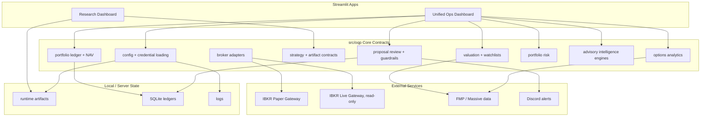

# Alpha Factory

Alpha Factory is a private, work-in-progress quantitative research and trading
operations platform. It combines factor research, portfolio monitoring, broker
connectivity, paper-trading review, and Streamlit dashboards into one organized
repo.

The project is being built as a serious research and engineering portfolio for
quant finance graduate applications and, more importantly, as a practical system
for my own strategy development. The repository is private while the architecture
is still changing and while live research edge remains local/private.

## Current Shape

The repo is converging toward two dashboard surfaces:

- **Research Dashboard**: factor research, strategy comparison, promotion
  pipeline, data artifact checks, and alpha governance.
- **Ops Dashboard**: the unified operating cockpit for live read-only portfolio
  monitoring, paper trading, execution review, risk snapshots, server health,
  IBKR gateway status, scheduler status, and Discord alerts.

The Ops Dashboard is organized around the daily workflow: Homepage, Live
Portfolio, Paper Trading, Discretionary Workbench, Risk Control Room, Execution
Strategy Monitor, and Journal Reports.

The core shared logic lives under `src/oqp/`. The `departments/` tree is the
organizational map for platform, research, data, investing, risk, trading, and
middle-office work.

## Architecture



## Safety Posture

The platform is deliberately conservative:

- Live IBKR access is treated as **read-only monitoring**.
- Paper trading is separated from live trading through broker profiles and
  environment gates.
- `ALLOW_LIVE_TRADING=false` is the default expectation.
- Paper proposals are reviewed through a safety layer before the guarded broker
  submission path can touch IBKR paper.
- Secrets, broker credentials, ledgers, runtime artifacts, raw data, logs,
  model checkpoints, and local Streamlit secrets are ignored by Git.
- Live alpha factor implementations are private by default.

## Repository Map

```text
apps/
  research_dashboard/         Alpha research and promotion workflow
  ops_dashboard/              Unified live, paper, risk, execution, ops cockpit

src/oqp/
  brokers/                    IBKR and broker adapter contracts
  config/                     Settings, paths, credentials
  contracts/                  Strategy candidate and artifact schemas
  execution/                  Trade proposals and guardrails
  investing/                  Stock valuation and watchlists
  intelligence/               Advisory engines, registries, and coordinator
  market/                     Price-history and historical-volatility helpers
  options/                    Options analytics and proposal bridge
  paper_trading/              Paper ledger and execution safety
  portfolio/                  Portfolio ingestion, NAV, snapshots
  risk/                       Portfolio risk analytics

departments/
  data_platform/              Data storage map and vendor/data process notes
  middle_office/              Account contracts, reconciliation, controls
  platform/                   Deployment and scheduler runbooks
  research/                   Alpha lab policy and public/private boundary
  risk/                       Options risk policy and promotion notes
  trading/                    Paper trading process and order examples

scripts/                      Server jobs and health checks
tests/                        Unit tests for contracts, ledgers, dashboards
notebooks/                    Educational/research notebooks
```

## Script Boundary

Root scripts are command entrypoints. They should parse arguments, load runtime
settings, call package-owned services under `src/oqp/`, print a result, and
return an exit code. Reusable checks, ledgers, business rules, backtest
workflows, notification helpers, and SQL belong in `src/oqp`, not in `scripts/`.

## Notebooks

The `notebooks/` folder is an audience-facing research and learning layer. It is
not the production trading system and should not contain private alpha edge,
broker state, credentials, or live portfolio data.

It is now organized as a phased quant curriculum:

- **Phase 0**: mathematical and computational foundations
- **Phase 1**: data infrastructure, return hygiene, empirical diagnostics, and
  volatility estimation
- **Phase 2**: stochastic modelling, derivatives pricing, implied volatility,
  local volatility, SABR/Heston, Greeks, and hedging
- **Phase 3**: alpha research, econometrics, regime modelling, ML forecasting,
  statistical arbitrage, and feature governance
- **Phase 4**: portfolio construction, factor attribution, PCA risk, VaR/CVaR,
  HRP, Black-Litterman, stochastic control, and fixed-income risk
- **Phase 5**: backtesting, validation, execution-cost modelling, walk-forward
  testing, PBO, White's Reality Check, live-paper dashboards, and tearsheets
- **Phase 6**: execution, market microstructure, order-flow models, market
  making, routing, latency budgets, and C++/Python execution kernels
- **Phase 7**: reserved for larger integrated research projects

Notebook-generated data artifacts are local outputs, not the repo's public
surface. The committed material should be the educational notebooks and any
explicitly public helpers, while generated CSV/parquet/database/model files stay
ignored.

## Deployment Direction

Current deployment work targets an Ubuntu server running:

- IBKR Gateway containers for live read-only and paper monitoring
- scheduled portfolio and paper snapshot jobs
- SQLite-backed portfolio and paper ledgers
- Discord health notifications
- Streamlit dashboards exposed only through controlled access

AWS is useful, but not mandatory for the core architecture. The immediate goal
is reliable server operation and paper-trading monitoring before any production
execution path.

## Intelligence Engines

`src/oqp/intelligence/` is the modular engine layer. It mirrors the research
lab style: category folders such as `risk_engine`, `regime_engine`, `ml_engine`,
`allocation_engine`, and `signal_engine`, with shared base contracts and one
coordinator.

Current engines:

- Portfolio Manager: post-approval command center for approved strategy runtime
  posture.
- Risk Control Room: read-only live/paper account risk flags.
- Regime Snapshot: return/volatility regime read, plus HMM-compatible
  `MarketHMM` and `MarketGMMHMM` classes.
- Allocation Advisory: HRP, fractional Kelly, volatility targeting, and
  constraints; skipped until research returns/signals are connected.

The intended order is: research approves a strategy for a specific market and
account lane, then intelligence manages runtime triggers and sizing posture,
then trade proposals and safety review convert those runtime decisions into
paper/live execution attempts.

## Live Portfolio Page

The Ops dashboard now has a first multipage sidebar page:

```text
apps/ops_dashboard/pages/01_Live_Portfolio.py
```

It contains:

- Overview: NAV, daily P&L, weekly performance, asset sleeve mix, and system
  reads
- Holdings: IBKR plus manual external holdings, native/reporting currencies,
  market value, cost basis, unrealized P&L, and `HV 5D` / `HV 20D`
- Exposure: marked sector/sleeve/currency exposure, option-adjusted underlying
  exposure, factor proxy diagnostics, and PCA crowding
- Options Hub: option book audit, package recognition, payoff lab, Greeks/risk,
  and volatility/model audit
- Reconciliation: account ledger, risk lab structure, risk-history cache, Ops
  checks, and latest live events

Reusable logic lives in `src/oqp/market/volatility.py`,
`src/oqp/risk/live_factor_lab.py`, `src/oqp/options/book.py`,
`src/oqp/options/spread_recognition.py`, and
`src/oqp/portfolio/live_reporting.py`.

## Local Usage

Install dependencies in a virtual environment, copy the environment template,
then run dashboards with `PYTHONPATH=src:.`.

```bash
python -m venv .venv
source .venv/bin/activate
pip install -r requirements.txt
cp .env.example .env

PYTHONPATH=src:. streamlit run apps/research_dashboard/Homepage.py --server.port 8524
PYTHONPATH=src:. streamlit run apps/ops_dashboard/Homepage.py --server.port 8529

# Or launch the local bookmarked dashboard ports with the project venv:
./scripts/start_local_dashboards.sh
```

The dashboards can boot without broker/vendor keys, but live data features need
local credentials in `.env`. A fresh clone should expect empty dashboard states
until runtime ledgers are generated or synced. The repo never commits `.env`,
SQLite ledgers, runtime artifacts, broker exports, or generated market data.

Run tests:

```bash
PYTHONPATH=src:. python -m unittest discover tests

# Focused migrated research dashboard check:
./scripts/research/check_research_dashboard.sh
```

## Public / Private Boundary

This repository is currently private. Before it becomes public, the alpha
research surface needs another review. The current policy is:

- publish framework, contracts, dashboards, synthetic examples, and docs
- keep live factor implementations, cached market data, execution logs,
  candidate artifacts, model files, and broker/account state private
- publish retired factors only after sanitizing them into explicit public
  examples

See:

- `ARCHITECTURE.md`
- `departments/research/README.md`
- `departments/research/decommission_readiness.md`
- `departments/research/public_private_boundary.md`
- `departments/research/public_allowlist.md`
- `departments/platform/deployment/repo_commit_readiness.md`

## Status

This is not a finished product. The big restructuring skeleton is in place, with
the near-term focus on:

1. keeping server deployment reproducible and synced
2. polishing dashboards into useful daily command centers
3. keeping private alpha edge out of public commits
4. running paper strategies long enough to evaluate stability
5. leaving live trading future-gated until paper evidence and controls mature
