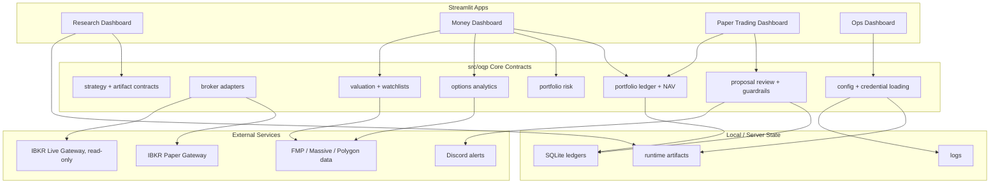

# Alpha Factory

Alpha Factory is a private, work-in-progress quantitative research and trading
operations platform. It combines factor research, portfolio monitoring, broker
connectivity, paper-trading review, and Streamlit dashboards into one organized
repo.

The project is being built as a serious research and engineering portfolio for
quant finance graduate applications and, more importantly, as a practical system
for my own strategy development. The repository is private while the architecture
is still changing and while live research edge remains local/private.

## Current Shape

The repo is organized around three dashboard surfaces:

- **Research Dashboard**: factor research, strategy comparison, promotion
  pipeline, data artifact checks, and alpha governance.
- **Money Dashboard**: real portfolio monitoring, investing tools, risk views,
  and options analysis.
- **Paper Trading Dashboard**: IBKR paper monitoring, paper NAV/P&L, proposal
  review, execution safety gates, and Discord health alerts.

The core shared logic lives under `src/oqp/`. The `departments/` tree is the
organizational map for platform, research, data, investing, risk, trading, and
middle-office work.

## Architecture



## Safety Posture

The platform is deliberately conservative:

- Live IBKR access is treated as **read-only monitoring**.
- Paper trading is separated from live trading through broker profiles and
  environment gates.
- `ALLOW_LIVE_TRADING=false` is the default expectation.
- Paper proposals are reviewed through a safety layer before any future broker
  execution path.
- Secrets, broker credentials, ledgers, runtime artifacts, raw data, logs,
  model checkpoints, and local Streamlit secrets are ignored by Git.
- Live alpha factor implementations are private by default.

## Repository Map

```text
apps/
  money_dashboard/            Real portfolio, risk, valuation, options
  paper_trading_dashboard/    Paper account monitoring and safety review
  research_dashboard/         Alpha research and promotion workflow
  ops_dashboard/              Operational health surface

src/oqp/
  brokers/                    IBKR and broker adapter contracts
  config/                     Settings, paths, credentials
  contracts/                  Strategy candidate and artifact schemas
  execution/                  Trade proposals and guardrails
  investing/                  Stock valuation and watchlists
  options/                    Options analytics and proposal bridge
  paper_trading/              Paper ledger and execution safety
  portfolio/                  Portfolio ingestion, NAV, snapshots
  risk/                       Portfolio risk analytics

departments/
  data_platform/              Market data, vendors, feature store plans
  investing/                  Portfolio book, performance, valuation
  middle_office/              Reconciliation, controls, reporting
  platform/                   Deployment, schedulers, observability
  research/                   Alpha lab policy and public/private boundary
  risk/                       Risk department structure
  trading/                    Paper/live trading and order management
  archive/                    Retired legacy apps and source references

scripts/                      Server jobs and health checks
tests/                        Unit tests for contracts, ledgers, dashboards
notebooks/                    Educational/research notebooks
```

## Notebooks

The `notebooks/` folder is an audience-facing research and learning layer. It is
not the production trading system. The notebooks are currently grouped into
modules covering:

- empirical statistics and volatility analysis
- time-series econometrics
- stochastic calculus and derivative pricing
- options sensitivities and hedging
- convex optimization and systemic risk
- algorithmic backtesting architecture

These notebooks are intentionally left as a pending polish lane. Over time they
should become cleaner, more narrative, and better aligned with the dashboard and
research pipeline.

## Deployment Direction

Current deployment work targets an Ubuntu server running:

- IBKR Gateway containers for live read-only and paper monitoring
- scheduled portfolio and paper snapshot jobs
- SQLite-backed portfolio and paper ledgers
- Discord health notifications
- Streamlit dashboards exposed only through controlled access

AWS is useful, but not mandatory for the core architecture. The immediate goal
is reliable server operation and paper-trading monitoring before any production
execution path.

## Local Usage

Install dependencies in a virtual environment, then run dashboards with
`PYTHONPATH=src:.`.

```bash
python -m venv .venv
source .venv/bin/activate
pip install -r requirements.txt

PYTHONPATH=src:. streamlit run apps/money_dashboard/app.py
PYTHONPATH=src:. streamlit run apps/paper_trading_dashboard/app.py
PYTHONPATH=src:. streamlit run apps/research_dashboard/app.py
```

Run tests:

```bash
PYTHONPATH=src:. python -m unittest discover tests
```

## Public / Private Boundary

This repository is currently private. Before it becomes public, the alpha
research surface needs another review. The current policy is:

- publish framework, contracts, dashboards, synthetic examples, and docs
- keep live factor implementations, cached market data, execution logs,
  candidate artifacts, model files, and broker/account state private
- publish retired factors only after sanitizing them into explicit public
  examples

See:

- `departments/research/alpha_lab/public_private_boundary.md`
- `departments/research/alpha_lab/public_allowlist.md`
- `departments/platform/deployment/repo_commit_readiness.md`

## Status

This is not a finished product. The repo is in active restructuring, with the
near-term focus on:

1. syncing the committed structure to the Ubuntu server
2. improving paper dashboard monitoring and Discord reporting
3. polishing the money dashboard around portfolio history, drawdown, and risk
4. tightening the research-to-paper candidate bridge
5. upgrading notebooks and public-facing documentation later
